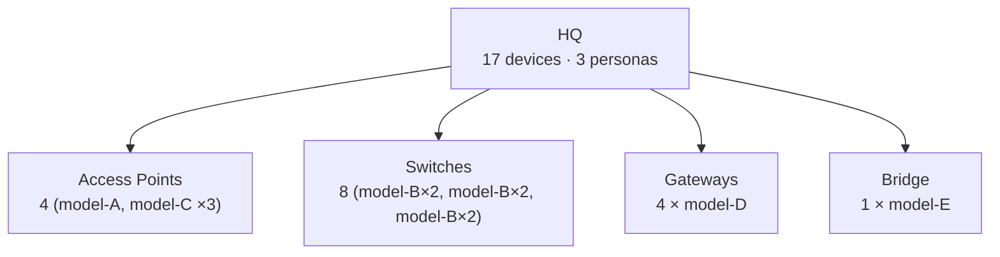

# Aruba Central scope hierarchy visualizer

## Objective

Render the Central scope hierarchy — Global → site-collections → sites
→ device-collections → devices — at whatever zoom level fits the
operator's question. The output can be:

- A **top-level overview** with resource counts at each scope (the
  most common request).
- A **drilled-in subtree** focused on one site or one site-collection.
- A **per-scope inspector** showing exactly what config is committed
  there + what's inherited from parents.
- A **device-type rollup** for one site (8 switches, 4 gateways, etc.).
- A **committed-vs-effective diff** for one scope showing the
  inheritance contribution.

**Read-only.** Does not mutate any Central config.

## Operator-output rules (read first)

These constrain every response you produce inside this skill:

1. **Aggregate by default, enumerate on demand.** When a scope has 4+
   sibling site-collections, show them as one aggregated node
   ("4 Site Collections — Region-A · Region-B · Region-C · Region-D")
   with an affordance to expand. When a site has 17 devices spanning
   5 models, show them grouped by type ("Switches — 8 (CX-8360×2,
   CX-6300×2, CX-6200×2)") not as 17 individual rectangles.
   Enumerated walls of nodes are unreadable; the operator can ask to
   drill in.
2. **Resource counts on every node.** Each scope's most useful single
   number is "how much config lives here?" Always include resource
   count (from `tree_to_dict`'s `resource_count`) and device count
   (`device_count`) on every visible node.
3. **NEVER expose raw numeric scope IDs to the user.** Values like
   `"1234567890"` or `"9876543210"` are internal identifiers —
   operators don't recognize them. Use scope NAMES (`"HQ"`,
   `"East Region Sites"`, `"Global"`) in user-facing output. When a
   scope has no friendly name (some intermediate site-collection
   nodes), show its TYPE plus child counts instead (e.g.
   "Site collection · 3 sites · 12 devices") rather than the ID.
4. **Color-code by node type** in the legend: Global (gray/neutral),
   Site collection (orange/green), Site (blue), Device collection
   (yellow/purple), Device (white/gray-outline). Match the legend
   labels to the type values returned by the tree:
   `GLOBAL` / `SITE_COLLECTION` / `SITE` / `DEVICE_COLLECTION` /
   `DEVICE`.
5. **Don't blindly call `central_get_scope_diagram`.** It returns a
   single Mermaid string that doesn't aggregate and produces an
   unreadable wall on real tenants. Use it only as a last-resort
   text-mode fallback when the client truly cannot render anything
   else.

## Prerequisites

- The operator has indicated what they want to see (full tree / one
  site / committed vs effective / etc.). When the request is
  ambiguous, default to the top-level overview (Step 1) and offer to
  drill in.

## Response shapes

| Tool | `data` shape | Iterate via |
|---|---|---|
| `central_get_scope_tree(view="committed"\|"effective")` | dict with `scope_id, scope_name, type, persona_count, resource_count, child_scope_count, device_count, personas: [...], children: [...]` recursively | `node["children"]` for recursion; `node["resource_count"]` / `node["device_count"]` for per-scope counts; `node["personas"][*]["categories"]` for resource-category breakdown |
| `central_get_scope_resources(scope_id, persona?, include_details?)` | dict with `scope_id, scope_name, type, personas: [{name, resources: [{name, has_details, details?}]}]` | committed-only view of ONE scope; use the `personas[*].resources` lists |
| `central_get_committed_config(scope_id, persona?, include_details=True)` | dict with `scope_id, scope_name, type, scope_path, committed_resources: [{persona, name, has_details, details?}]` | **flat** committed list; ideal for side-by-side diff against `effective_resources` (same per-resource shape) |
| `central_get_effective_config(scope_id, persona?, include_details?)` | dict with `scope_id, scope_name, type, inheritance_path, effective_resources: [{name, instances: [{origin_scope_id, origin_scope_name, persona, has_details, details?}]}]` | each resource has an `instances` list — multiple instances mean the same resource is committed at multiple ancestor scopes |
| `central_get_devices_in_scope(scope_id, device_type?)` | dict with `scope_id, devices: [{scope_id, scope_name, category, persona, device_type, device_model, serial_number, mac_address, part_number}]` | flat device list; aggregate by `device_type` + `device_model` for the "Switches — 8 (8360×2, 6300×2)" rollup |
| `central_get_scope_diagram(scope_id?, include_resources?, include_devices?)` | bare string — Mermaid `flowchart TD` source | Avoid by default (see Output rule 5). Use only as text-mode fallback. |

## Procedure

### Step 0 — Pick the zoom level from the operator's request

| User request | Zoom level | Primary tool |
|---|---|---|
| "visualize the scope hierarchy" / "show me the scope tree" / "draw the Central scope" | **Top-level overview** | `central_get_scope_tree(view="committed")` |
| "show me what's at site HQ" / "what does BRANCH-1 look like" | **Drilled-in subtree** for one site | `central_get_scope_tree` + `central_get_devices_in_scope(scope_id=<site>)` |
| "what config is at <scope>" / "what's directly assigned here" | **Committed config at one scope** | `central_get_committed_config(scope_id=<scope>)` |
| "what's the effective config at <scope>" / "where does <resource> come from at <scope>" | **Effective config at one scope** | `central_get_effective_config(scope_id=<scope>)` |
| "what did the parent contribute vs what was added at <scope>" / "committed vs effective at <scope>" | **Both views — diff** | `central_get_committed_config` + `central_get_effective_config` side-by-side |

Default when the request is ambiguous: top-level overview with an offer to drill in.

### Step 1 — Fetch the structured tree (always)

**Tool:** `central_get_scope_tree(view="committed")`
**Why:** This is the foundation. It returns the **whole hierarchy** with per-scope `resource_count`, `device_count`, `persona_count`, `child_scope_count`, and per-persona `categories` breakdown. One call gives you everything needed for the top-level overview AND the data for any drilled-in view.
**Expected:** A dict with `scope_id="Global"` (or numeric tenant root) and recursive `children`. Resource counts are populated at every level.

**View choice:**

- `view="committed"` (default) — what's directly assigned at each scope. Use this for the structural overview.
- `view="effective"` — adds inherited resources at every descendant scope. Use this when the operator's question is about what's actually applied at the leaves (a SITE scope's `resources` includes everything that flows down from Global + its site-collection ancestors).

### Step 2 — Render the requested zoom level

Pick the template that matches Step 0's zoom level.

#### 3a — Top-level overview (most common)

Goal: a card-style tree showing Global → site-collections → sites with
resource counts on each node. Aggregate sibling collapses when there
are 4+ same-type siblings.

Pattern for each visible node:

```
+----------------------------+
|  <scope_name>              |   ← bold, no scope_id
|  <count> resources         |   ← from resource_count
|  · <count> devs (optional) |   ← from device_count when > 0
+----------------------------+
```

When you have 4+ sibling site-collections under Global, fold them into one node:

```
+-------------------------------------+
|  4 Site Collections                 |
|  Region-A · Region-B · Region-C ... |   ← first ~3 names, then "..."
+-------------------------------------+
```

The legend goes at the **top** of the response (above the tree), not the bottom:

```
[Global] [Site collection] [Site] [Device collection] [Device]
```

Color-code each node by `type`. Use rendering that fits the client:

- **Rich-client (web widget, React Flow, vis-network)**: build a card tree from the structured `central_get_scope_tree` output.
- **Mermaid-only**: emit a `flowchart TD` with rectangular nodes (`A[<name><br/>X resources]`), one per visible scope. Always use rectangles `[...]`, never circles `((...))` — circles truncate labels at scale.
- **Plain text fallback**: bullet tree with counts.

End the overview with a one-line offer: *"Want to drill into a specific site or see committed-vs-effective config for one scope?"*

#### 3b — Drilled-in subtree for one site

Goal: show one site (HQ, BRANCH-1, etc.) with its device-type rollups underneath.

```python
# Step 2b — find the site_id then get device inventory
tree_resp = await call_tool("central_get_scope_tree", {"view": "committed"})
# walk the tree to find the named site → grab its scope_id
# ... (paste central-scope-walker snippet to do the name-to-id resolution)

dev_resp = await call_tool("central_get_devices_in_scope", {"scope_id": site_id})
devices = dev_resp["data"]["devices"]
# Aggregate: group by device_type, then sub-group by device_model
from collections import Counter
type_counts = Counter(d["device_type"] for d in devices)
by_type_then_model = {}
for d in devices:
    by_type_then_model.setdefault(d["device_type"], Counter())[d["device_model"]] += 1
```

Render the site as the root, with one child per device TYPE (not per device):

```
+----------------------+
|  HQ                  |
|  17 devices · 3 personas |
+----------------------+
        |
   +-----+------+-----+--------+
   |     |      |     |        |
+----+ +----+ +----+ +-------+
| APs| | SW | | GW | | Bridge|
| 4  | | 8  | | 4  | | 1     |
| (model-A,| | (model-B×2,| | (model-D ×4) | | (model-E ×1)|
| model-C×3)| model-B×2, |
+----+ | model-B×2)|
       +-------+
```

In Mermaid:



#### 3c — Per-scope config (committed)

Goal: chip-list of all resources directly assigned at one scope,
grouped by persona, with category sub-grouping (Policies, Roles,
Aliases, etc.).

```python
# Step 2c — committed config at one scope
cfg = await call_tool("central_get_committed_config", {"scope_id": scope_id})
# Group by persona → category → resource name for chip rendering
# Personas: CAMPUS_AP, ACCESS_SWITCH, BRANCH_GW, MOBILITY_GW, etc.
# Categories inferred from resource name prefix: "policies/X" → Policies,
# "roles/X" → Roles, "aliases/X" → Aliases, etc.
```

Render as labelled groups of chips per persona, with category headers
inside each persona block. Example (one persona block):

```
Global › East Region Sites  [CAMPUS_AP]
51 resources committed at this scope — these are inherited by HQ and BRANCH-1

POLICIES (17)
[policy-A] [policy-B] [policy-C] [policy-D] ...

ROLES (13)
[role-A] [role-B] [role-C] ...

ALIASES (7)
[CORP-LAB] [user-alias] [user-vlan] ...
```

Always include the **inheritance flow statement** at the top: *"These N resources flow down to all sites in <site-collection>. The <site> site adds M more on top: …"* — operators need to know what's reused vs site-specific.

#### 3d — Per-scope config (effective)

Goal: same as 3c but showing inheritance origin. Each resource has an
`origin_scope_name` indicating where it was committed (could be the
current scope, its parent collection, Global, etc.).

```python
eff = await call_tool("central_get_effective_config", {"scope_id": scope_id})
# eff["data"]["effective_resources"] is a list of {name, instances: [{origin_scope_name, persona, ...}]}
```

Render as chip-list with the origin scope visible per chip — color-code or label by origin. Example chip:

```
[policy-A ← Global]   [policy-B ← East Region Sites]   [policy-C ← HQ]
```

#### 3e — Committed vs effective diff for one scope

Goal: side-by-side comparison so the operator can see what each scope contributes.

Call both `central_get_committed_config(scope_id)` AND `central_get_effective_config(scope_id)` with the same `scope_id`. Compute:

- **Inherited only**: in `effective_resources` but NOT in `committed_resources`.
- **Committed here**: in both lists (and `origin_scope_name == current scope` in the effective view).
- **Total effective**: `inherited + committed_here`.

Render two columns or stacked sections:

```
Committed at <scope> (M resources)
  POLICIES (...) [chip] [chip] [chip]
  ROLES (...) [chip] [chip]

Inherited from ancestors (N resources)
  From Global: [chip ← Global] [chip ← Global]
  From EST Sites: [chip ← EST Sites] [chip ← EST Sites]
```

### Step 3 — Walkthrough beneath the diagram

Below every visualization, add a short (3-6 sentence) walkthrough in plain English:

- For top-level overview: which scope carries the most config, where the device weight lives, what the inheritance shape implies ("Global owns N library resources; the lion's share of device config lives at <site-collection>; site-level customization is light").
- For drilled-in site: device-mix breakdown, anything notable (single STACK, mixed-vendor uplinks, etc.).
- For per-scope inspector: what's reused vs what's site-specific.

Reference scope names (not IDs). Operators will use the walkthrough to know what to ask next.

### Step 4 — Always offer the next zoom level

End every response with a one-line affordance:

- Top-level overview → "Want to drill into a site, or see what's committed/effective at a specific scope?"
- Drilled-in site → "Want the committed config for this site, or the effective view showing what's inherited?"
- Per-scope inspector → "Want to see the committed config at the parent scope to understand what's inherited?"

## Worked example — top-level overview request

Operator: *"Visualize the Central scope hierarchy."*

```python
# Step 1
tree_resp = await call_tool("central_get_scope_tree", {"view": "committed"})
tree = tree_resp.get("data", {})

# Step 2a — top-level overview
# Walk the tree's root + direct children. Aggregate device groups.
root = tree
collections = []
device_groups = []
for child in root.get("children", []):
    if child.get("type") == "SITE_COLLECTION":
        collections.append(child)
    elif child.get("type") == "DEVICE_COLLECTION":
        device_groups.append(child)

# Render: Global at top, collections + a single "X Device groups" aggregate node beneath.
# For each collection with > 4 child sites, also aggregate its children to "X Sites" until expanded.
```

Reply (rich-client variant — embed card tree; chips for legend):

```
[Global] [Site collection] [Site] [Device collection] [Device]

┌───────────────────────────────────────┐
│  Global                               │
│  399 resources                        │
└───────────────────────────────────────┘
           │
   ┌───────┼────────────┬──────────────┐
   │       │            │              │
┌─────────┐ ┌──────────┐ ┌──────────────┐ ┌──────────────┐
│  East   │ │  West    │ │ 4 Site       │ │ 28 Device    │
│  Region │ │  Region  │ │ Collections  │ │ Collections  │
│  177r   │ │  14r     │ │ Region-A ·   │ │ (group-1,    │
└─────────┘ └──────────┘ │ Region-B ... │ │  group-2,    │
                         └──────────────┘ │  group-3 ...)│
                                          └──────────────┘
   │
┌──────────┬──────────┐
│   HQ     │ BRANCH-1 │
│   52r ·  │  12r     │
│   17d    │          │
└──────────┴──────────┘

**Walkthrough:** Global carries the lion's share of the library (399 resources, mostly platform-level: aliases, auth servers, system policies). East Region Sites adds 177 resources that flow down to HQ (52 site-specific on top) and BRANCH-1 (12 site-specific). West Region is a thin collection (14 resources). The 4 site collections at right are organizational containers with light direct config — most config lives one level up in the per-region collections.

Want to drill into a site, or see what's committed/effective at a specific scope?
```

## When NOT to use this skill

- **"List sites"** — call `central_get_sites` / `central_get_site_name_id_mapping` directly; visualization is overkill.
- **"What's the effective config for one specific resource"** — call `central_get_effective_config(scope_id=..., persona=..., include_details=True)` directly and present the resource dict.
- **"Resolve a site name to its scope_id"** — use the `central-scope-walker` skill (the utility for name→ID resolution; this skill is for the bigger picture).
- **"Audit scope assignments for compliance"** — use the `central-scope-audit` skill, which is the broader audit runbook.

## Performance notes

`central_get_scope_tree` builds the entire scope tree in one call (~1-2s on
a typical tenant). The structured output is everything the AI needs for
the top-level overview — no per-scope round-trips required. Per-scope
inspectors (`central_get_committed_config`, `central_get_effective_config`,
`central_get_devices_in_scope`) are sub-second per call. On very large
tenants (100+ sites), prefer aggregated rendering by default and only
drill in on operator request.

`central_get_scope_diagram` exists but is **deprecated for visualization
purposes** — its Mermaid output sprawls horizontally on real tenants and
makes device groups disconnected islands. Use the structured tree from
`central_get_scope_tree` and render however your client supports. The
diagram tool stays available as a text-mode fallback when nothing else
works.
